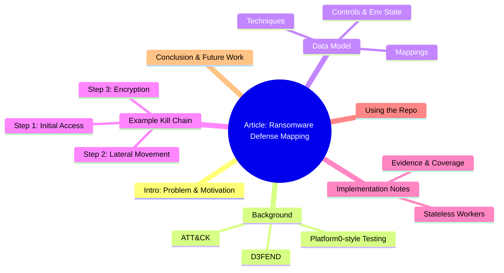

# Article Structure

```mermaid
mindmap
  root((Article: Ransomware Defense Mapping))
    Intro: Problem & Motivation
    Background
      ATT&CK
      D3FEND
      Platform0-style Testing
    Data Model
      Techniques
      Mappings
      Controls & Env State
    Example Kill Chain
      Step 1: Initial Access
      Step 2: Lateral Movement
      Step 3: Encryption
    Implementation Notes
      Stateless Workers
      Evidence & Coverage
    Using the Repo
    Conclusion & Future Work
```
