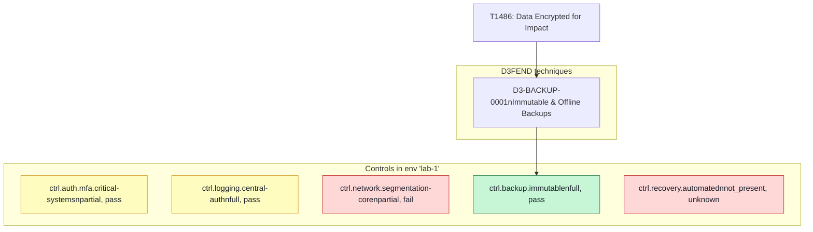

# Modeling Ransomware Defense with ATT&CK, D3FEND, and Platform0-style Testing

## 1. Introduction: From ATT&CK Diagrams to Tested Ransomware Defenses

Most teams now recognize ransomware as a top-tier risk and can point to a slide or wiki page showing a **MITRE ATT&CK kill chain**. In practice, though, those diagrams often stop at the "what attackers do" layer. They do not tell you, per environment, whether concrete defenses are deployed and actually tested.

This article describes a small, inspectable way to bridge that gap. Instead of treating ATT&CK as a static reference, we:

- Take a **ransomware-focused subset** of ATT&CK techniques.
- Map each to a small set of **MITRE D3FEND defensive techniques**.
- Map those to **concrete security controls** that can be executed and verified using a Platform0-style pattern (stateless jobs + durable evidence).

The result is a simple lens you can run against each environment to answer questions like:

- *For this ransomware technique, which defenses are we relying on?*
- *Where do we have controls that are deployed, but not tested?*
- *Where are we missing controls entirely?*

The implementation in this article is deliberately small. It is intended as a **reference pattern** you can fork, inspect, and adapt, not as a complete ransomware simulation framework.

---

## 2. Background: ATT&CK, D3FEND, and Platform0-style Control Testing

### 2.1 MITRE ATT&CK for ransomware

MITRE ATT&CK is a knowledge base of adversary behaviors, expressed as **tactics** (goals) and **techniques** (how those goals are achieved). For ransomware, the relevant techniques typically span:

- **Initial Access** (for example, valid accounts, phishing)
- **Execution** (for example, command and scripting interpreters)
- **Lateral Movement** (for example, remote services)
- **Impact** (for example, data encrypted for impact, inhibit system recovery)

In many organizations, ATT&CK is used to label alerts or create slides for tabletop exercises. What is often missing is a **direct connection from a technique ID (like T1486) to specific controls and tests**.

### 2.2 MITRE D3FEND as defensive patterns

MITRE D3FEND is a complementary knowledge base that describes **defensive techniques**. Where ATT&CK focuses on *what* adversaries do, D3FEND focuses on *how* defenders can prevent, detect, or respond.

For example, for the techniques above, we might lean on D3FEND-like patterns such as:

- Multi-factor authentication for critical systems
- Centralized authentication logging
- Network segmentation and isolation
- Immutable and offline backups
- Automated recovery procedures

These patterns provide a vocabulary for reasoning about **how** we defend against specific ransomware steps, but they still stop short of concrete, testable controls.

### 2.3 Platform0-style testing: jobs and evidence

A Platform0-style pattern treats each control test as a **stateless job** that runs in a container or worker and writes **durable evidence** into a shared location (for example, an object store or volume). Key ideas:

- Jobs take configuration and credentials as input.
- Jobs run checks (for example, "is MFA enforced for these systems?", "are immutable backups configured?") and emit **structured results**.
- Evidence is stored with metadata (environment, time, status, artifacts) so it can be inspected, trended, or audited later.

By combining ATT&CK, D3FEND, and Platform0-style jobs, we can move from a static model to a **runnable mapping** that answers: *“For this ransomware technique and this environment, what is the state of our defenses?”*

---

## 3. A Minimal Data Model for Ransomware Defense

To make the mapping runnable, we use a small set of JSON / JSONL files and corresponding Python models. The goal is **clarity over completeness**.

### 3.1 Attack techniques

`data/attack_techniques.json` contains a small subset of ransomware-relevant ATT&CK techniques. Each record captures the ID, tactic, and a short description, along with an explicit `ransomware_relevance` flag:
```json
{
  "id": "T1486",
  "name": "Data Encrypted for Impact",
  "tactic": "Impact",
  "description": "Adversaries may encrypt data on targeted systems to disrupt availability or to support extortion.",
  "ransomware_relevance": true
}
```

In code, this is represented by the `AttackTechnique` dataclass.

### 3.2 Defensive techniques (D3FEND subset)

`data/d3fend_techniques.json` holds a matching subset of D3FEND-style defensive techniques:
```json
{
  "id": "D3-BACKUP-0001",
  "name": "Immutable and Offline Backups",
  "category": "Resilience",
  "description": "Maintain immutable and/or offline backups that cannot be modified or deleted by compromised systems."
}
```

This is represented by the `D3fendTechnique` dataclass.

### 3.3 Attack → defense mappings

`data/attack_to_d3fend.jsonl` links ATT&CK techniques to D3FEND techniques. Each line is an independent JSON object with a short justification:
```json
{"attack_id": "T1490", "d3fend_id": "D3-RECOVERY-0001", "justification": "Automated recovery procedures reduce recovery time after backups are used following inhibited recovery."}
```

This becomes `AttackToD3fendMapping` in code. The mapping is intentionally coarse and easy to inspect.

### 3.4 Controls and environment state

`controls/controls.jsonl` defines logical controls that could be implemented and tested via Platform0-style jobs:
```json
{"id": "ctrl.backup.immutable", "name": "Immutable backup storage", "category": "backup", "scenario_id": "scn.backup.immutable.check", "evidence_schema_ref": "schemas/backup_immutable.json"}
```

`controls/env_controls.example.jsonl` records the **deployment and test state** of each control for a given environment (`env_id`):
```json
{"env_id": "lab-1", "control_id": "ctrl.backup.immutable", "deployment_state": "full", "last_test_time": "2025-12-27T17:45:00Z", "last_test_status": "pass"}
```

These are modeled as `Control`, `EnvControlState`, and a convenience wrapper `ControlWithState`. Together they allow the resolver to compute a simple per-technique `TechniqueCoverage` structure that powers the CLI.

---

## 4. Example Ransomware Kill Chain Walkthrough

To make this concrete, consider a simplified three-step ransomware kill chain in a lab environment `lab-1`:

1. **Initial access via valid accounts** – ATT&CK `T1078`
2. **Lateral movement via remote services** – ATT&CK `T1021`
3. **Data encryption and inhibited recovery** – ATT&CK `T1486` and `T1490`

### 4.1 Techniques and defenses

From the data files:

- `T1078` – **Valid Accounts** (Initial Access)
  - Defenses: `D3-AUTH-0001` (MFA), `D3-LOG-0001` (central auth logging)
- `T1021` – **Remote Services** (Lateral Movement)
  - Defenses: `D3-NET-0001` (network segmentation and isolation)
- `T1486` – **Data Encrypted for Impact** (Impact)
  - Defenses: `D3-BACKUP-0001` (immutable and offline backups)
- `T1490` – **Inhibit System Recovery** (Impact)
  - Defenses: `D3-BACKUP-0001` and `D3-RECOVERY-0001` (automated recovery)

These are example mappings in `attack_to_d3fend.jsonl`, but the structure is designed so you can inspect and adjust them for your own environment and threat model.

### 4.2 Controls and lab-1 state

The control catalog and environment file (`controls/controls.jsonl`, `controls/env_controls.example.jsonl`) describe how these defenses show up in `lab-1`:

- `ctrl.auth.mfa.critical-systems` – MFA for critical systems  
  `deployment_state = partial`, `last_test_status = pass`
- `ctrl.logging.central-auth` – central authentication logging  
  `deployment_state = full`, `last_test_status = pass`
- `ctrl.network.segmentation-core` – core network segmentation controls  
  `deployment_state = partial`, `last_test_status = fail`
- `ctrl.backup.immutable` – immutable backup storage  
  `deployment_state = full`, `last_test_status = pass`
- `ctrl.recovery.automated` – automated recovery runbooks  
  `deployment_state = not_present`, `last_test_status = unknown`

This gives you enough variation (full / partial / not_present, pass / fail / unknown) to highlight gaps.

### 4.3 Using the CLI for a single technique

Once the resolver and CLI are wired up, a basic query looks like this:
```bash
python3 -m src.cli map T1486 --env lab-1
```

Output (abbreviated):
```plain
ATT&CK: T1486 - Data Encrypted for Impact [Impact]

D3FEND techniques:

- D3-BACKUP-0001: Immutable and Offline Backups (Resilience)

Controls in environment 'lab-1':

- ctrl.auth.mfa.critical-systems: MFA for critical systems (deployment=partial, last_test_status=pass)
- ctrl.logging.central-auth: Centralized authentication logging (deployment=full, last_test_status=pass)
- ctrl.network.segmentation-core: Core network segmentation controls (deployment=partial, last_test_status=fail)
- ctrl.backup.immutable: Immutable backup storage (deployment=full, last_test_status=pass)
- ctrl.recovery.automated: Automated recovery runbooks (deployment=not_present, last_test_status=unknown)

Coverage score: 40.0% of in-scope controls are fully deployed and passing tests
```

This shows:

- Basic technique metadata for `T1486`.
- Mapped D3FEND techniques (for example, `D3-BACKUP-0001`).
- Mapped controls in `lab-1` and their deployment / test status.
- A simple coverage score indicating what fraction of in-scope controls are fully deployed and passing.

In this reference implementation, `T1486`’s coverage in `lab-1` reflects that some related controls (for example, network segmentation and recovery automation) are not fully deployed and passing tests, which keeps the score below 100%.

### 4.4 Chain-level interpretation

The same data can support a chain-level view, even if the CLI only exposes single-technique commands:

- For **initial access (`T1078`)**:  
  MFA is only partially deployed, but recent tests pass.  
  Central auth logging is fully deployed and passing, which improves detection.
- For **lateral movement (`T1021`)**:  
  Network segmentation controls are only partially deployed and the last test failed, indicating a clear gap.
- For **impact (`T1486` and `T1490`)**:  
  Immutable backups are fully deployed and passing tests.  
  Automated recovery runbooks are not present, so recovery still relies heavily on manual response.

This narrative becomes the raw material for both practitioner discussions and CPE documentation.

### 4.5 Visualizing coverage

You can use a simple diagram to summarize technique–defense–control relationships:


---

## 5. From Slides to Evidence: Computing Coverage per Environment

With the data model and resolver in place, we can move from a **diagram of defenses** to a **computed coverage view** for each environment.

### 5.1 Technique-level coverage

At a high level, the resolver computes coverage for a technique in an environment by:

1. Looking up the **ATT&CK technique** (for example, `T1486`).
2. Gathering its **D3FEND mappings** from `attack_to_d3fend.jsonl`.
3. Identifying relevant **controls** and their **environment-specific state**.
4. Calculating a simple score based on deployment and test status.

In the reference implementation, the scoring function is intentionally simple:

- Only controls with a recorded state for the environment are considered "in scope".
- A control contributes positively if:
  - `deployment_state == "full"`, and
  - `last_test_status == "pass"`.
- The coverage score is the fraction of in-scope controls that meet these criteria.

This yields a scalar between 0 and 1 (often expressed as a percentage) that you can track over time or compare between environments.

### 5.2 Interpreting gaps

The CLI exposes both **`map`** and **`gaps`** commands:

- `map` emphasizes:
  - Which defenses exist for a given technique.
  - How they are implemented and tested in a specific environment.
- `gaps` emphasizes:
  - Controls that are missing (`not_present`).
  - Controls that are only partially deployed.
  - Controls whose last tests failed or have never run.

For example, the `gaps` command for `T1486` in `lab-1` produces output like:
```bash
python3 -m src.cli gaps T1486 --env lab-1
```

```plain
Gaps for ATT&CK T1486 in env 'lab-1':

- ctrl.auth.mfa.critical-systems: MFA for critical systems (deployment=partial, last_test_status=pass)
- ctrl.network.segmentation-core: Core network segmentation controls (deployment=partial, last_test_status=fail)
- ctrl.recovery.automated: Automated recovery runbooks (deployment=not_present, last_test_status=unknown)
```

For a QSA, security architect, or internal auditor, this turns a slide-based ATT&CK discussion into a more grounded question: *“For this specific ransomware behavior, where do we still depend on hope rather than evidence?”*

### 5.3 Why a simple score is still useful

A single number will never capture the full nuance of ransomware readiness, but even a simple coverage score can be useful when:

- Comparing **environments** (for example, `lab-1` vs. `staging` vs. `prod`).
- Tracking **trends over time** as you roll out new controls or fix failing tests.
- Prioritizing **engineering work** (for example, automation for recovery may offer more marginal value than another detection tuning pass).

Because the underlying data is stored in transparent JSON / JSONL, you can always look past the score into the specific control states and test results driving it.

---

## 6. The Reference Implementation: Repository Tour

The repository that accompanies this article is deliberately small. It is designed to be read end-to-end and forked, not treated as a black box.

### 6.1 Data files

- `data/attack_techniques.json` – ransomware-relevant ATT&CK techniques.
- `data/d3fend_techniques.json` – corresponding D3FEND defensive techniques.
- `data/attack_to_d3fend.jsonl` – many-to-many mappings with justifications.
- `controls/controls.jsonl` – logical controls and their associated scenario IDs and evidence schemas.
- `controls/env_controls.example.jsonl` – environment-specific control states (starting with `lab-1`).

These files are small enough to read in a single sitting and are intended to be edited as you adapt the model.

### 6.2 Models and resolver

The `src/model.py` module defines a handful of dataclasses (`AttackTechnique`, `D3fendTechnique`, `AttackToD3fendMapping`, `Control`, `EnvControlState`, `ControlWithState`, `TechniqueCoverage`).

The `src/resolver.py` module:

- Loads JSON / JSONL data into a `DataStore`.
- Implements `resolve_defenses(attack_id, env_id)` to:
  - Look up the ATT&CK technique.
  - Gather D3FEND techniques.
  - Collect controls and their environment state.
  - Compute a simple coverage score.

This separation keeps the mapping logic explicit and testable.

### 6.3 CLI

The `src/cli.py` module provides two commands:

- `map` – display defenses and control states for a technique in an environment.
- `gaps` – highlight missing or underperforming controls for the same.

The CLI is intentionally minimal so that its behavior fits easily into a README example or a short lab exercise. You can extend it with chain-level views or richer formatting if that serves your use case.

### 6.4 Examples

The `examples/example_chain.md` file walks through the `lab-1` ransomware chain described in Section 4, using the real IDs from the data files and control catalog.

This example is the bridge between the conceptual article and the concrete CLI output, and is the first place to update once you adapt the model for your own environment.

---

## 7. Conclusion and Next Steps for Practitioners

Ransomware modeling often gets stuck at the level of **ATT&CK diagrams and tabletop slides**. Those artifacts are useful for shared understanding but do not, by themselves, answer the question: *“Are our defenses actually deployed and tested?”*

By combining a small ATT&CK subset, a handful of D3FEND-style defensive techniques, and a Platform0-style testing pattern, this reference implementation offers a lightweight way to:

- Tie specific ransomware techniques to concrete, testable controls.
- Compute simple, environment-specific coverage views.
- Turn subjective readiness conversations into more evidence-backed discussions.

To adapt this pattern for your own use:

1. Fork the repository and replace the ATT&CK and D3FEND subsets with techniques that match your environment and threat model.
2. Populate the control catalog with the controls and platforms you actually operate.
3. Add one or more real environments (for example, `prod`, `staging`, key lab tenants) with their control states and test history.
4. Integrate Platform0-style jobs or equivalent automation so that coverage scores are driven by **fresh evidence**, not manual guesses.

From there, you can decide how far to take it: keep it as an internal lab tool, bake it into your QSA preparation process, or evolve it into a richer ransomware readiness dashboard tailored to your practice.
