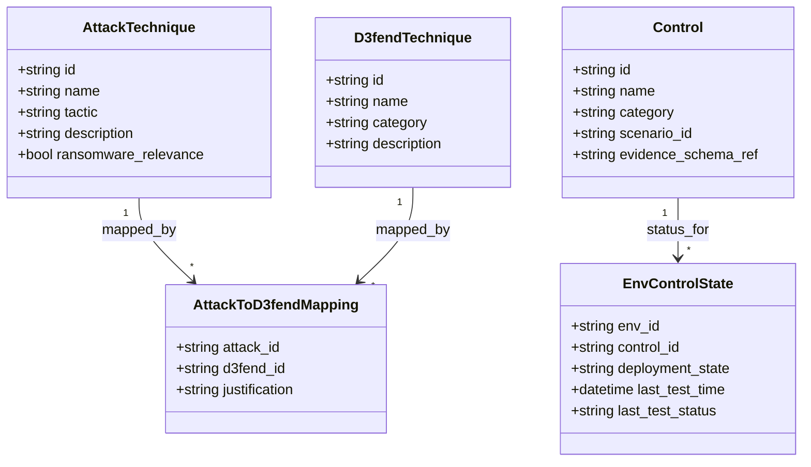

# Data Model (Class Diagram)

```mermaid
classDiagram
    class AttackTechnique {
      +string id
      +string name
      +string tactic
      +string description
      +bool   ransomware_relevance
    }

    class D3fendTechnique {
      +string id
      +string name
      +string category
      +string description
    }

    class AttackToD3fendMapping {
      +string attack_id
      +string d3fend_id
      +string justification
    }

    class Control {
      +string id
      +string name
      +string category
      +string scenario_id
      +string evidence_schema_ref
    }

    class EnvControlState {
      +string env_id
      +string control_id
      +string deployment_state
      +datetime last_test_time
      +string last_test_status
    }

    AttackTechnique "1" --> "*" AttackToD3fendMapping : mapped_by
    D3fendTechnique "1" --> "*" AttackToD3fendMapping : mapped_by
    Control "1" --> "*" EnvControlState : status_for
```
