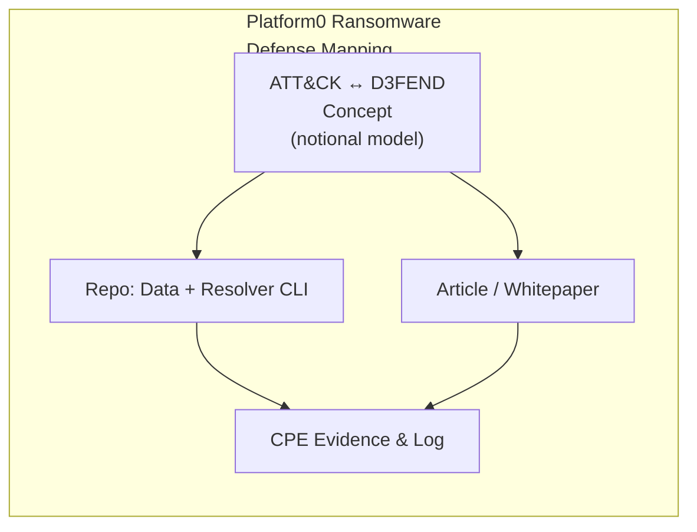

# High-Level Project Map

```mermaid
flowchart LR
    subgraph Idea[Platform0 Ransomware<br/>Defense Mapping]
        A["ATT&CK ↔ D3FEND<br/>Concept<br/>(notional model)"]
        B[Repo: Data + Resolver CLI]
        C[Article / Whitepaper]
        D[CPE Evidence & Log]
    end

    A --> B
    A --> C
    B --> D
    C --> D
```
