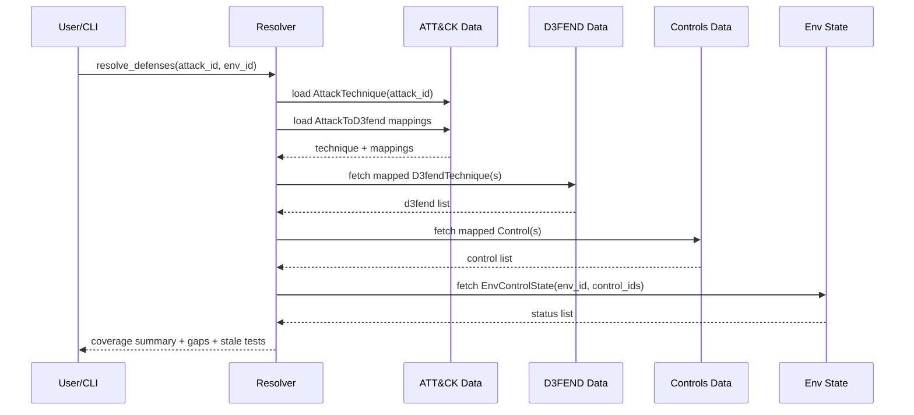

# Resolver Workflow

```mermaid
sequenceDiagram
    participant U as User/CLI
    participant R as Resolver
    participant DA as ATT&CK Data
    participant DD as D3FEND Data
    participant DC as Controls Data
    participant DE as Env State

    U->>R: resolve_defenses(attack_id, env_id)
    R->>DA: load AttackTechnique(attack_id)
    R->>DA: load AttackToD3fend mappings
    DA-->>R: technique + mappings

    R->>DD: fetch mapped D3fendTechnique(s)
    DD-->>R: d3fend list

    R->>DC: fetch mapped Control(s)
    DC-->>R: control list

    R->>DE: fetch EnvControlState(env_id, control_ids)
    DE-->>R: status list

    R-->>U: coverage summary + gaps + stale tests
```
