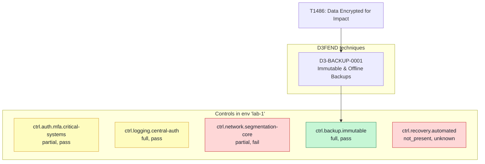

educational digram - coverage intrepration

```mermaid
flowchart TD
    T[T1486: Data Encrypted for Impact]

    subgraph Defenses[D3FEND techniques]
      DB[D3-BACKUP-0001<br/>Immutable & Offline Backups]
    end

    subgraph Controls[Controls in env 'lab-1']
      C1[ctrl.auth.mfa.critical-systems<br/>partial, pass]
      C2[ctrl.logging.central-auth<br/>full, pass]
      C3[ctrl.network.segmentation-core<br/>partial, fail]
      C4[ctrl.backup.immutable<br/>full, pass]
      C5[ctrl.recovery.automated<br/>not_present, unknown]
    end

    T --> DB
    DB --> C4

    classDef good fill:#C6F6D5,stroke:#2F855A,color:#1A202C;
    classDef warn fill:#FEFCBF,stroke:#D69E2E,color:#1A202C;
    classDef bad  fill:#FED7D7,stroke:#C53030,color:#1A202C;

    class C4 good;
    class C1,C2 warn;
    class C3,C5 bad;
```
